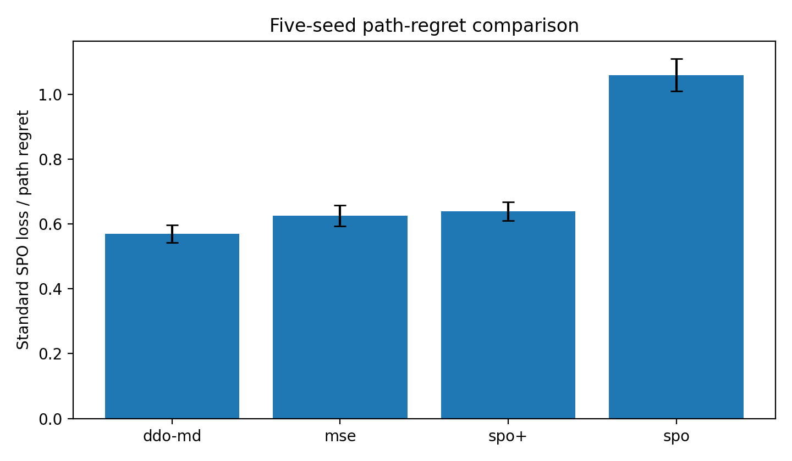
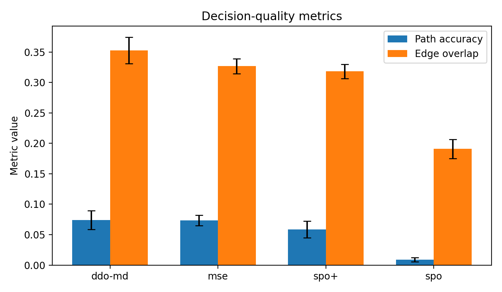
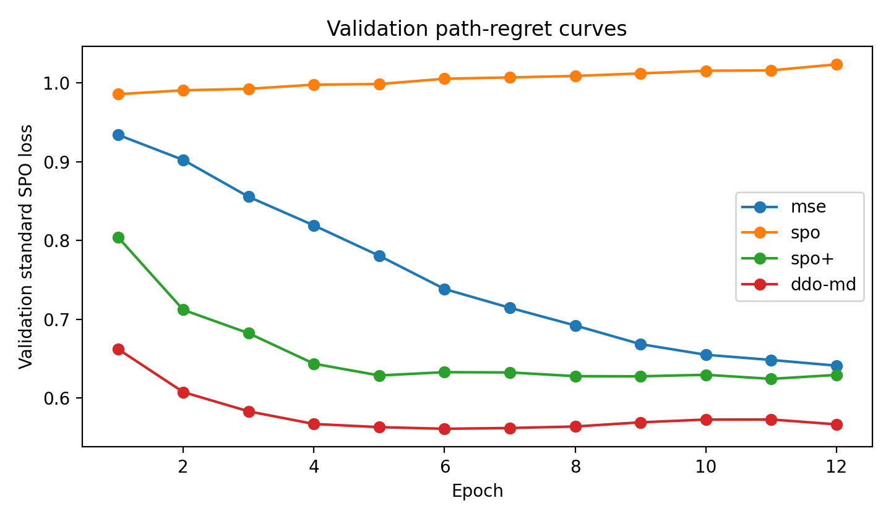

# DEEP DECISION OPTIMIZATION in LLM

Tiantian(Crystal) ZHANG @ Columbia University Undegrad  
contact: t.zhang8@columbia.edu (mailing author)

& Jierui(Jerry) Zuo @ UW incoming PhD, Tsinghua undegrad  
contact: zuojr22@gmail.com

Happy to contact and discuss ideas through email.

This repo implements the ideas first proposed in [RIPLM](https://arxiv.org/abs/2509.18138) (rank induced Plackett-Luce mirror descent). A fuller paper on DDO (Deep Decision Optimization), which generalizes RIPLM, is in progress.

# RIPLM vs General DFL Benchmarks

This repository contains a reproducible benchmark project comparing RIPLM against standard decision-focused learning (DFL) baselines on:

- a ranking-control task close to RIPLM's intended setting; and
- exact small-scale variants of canonical DFL benchmark families (`ShortestPath`, `Matching`, and `Knapsack`).

The repository keeps the generated benchmark artifacts that support the paper-style report, so it is ready both for inspection and for rerunning the experiments locally.

## Compiling the LaTeX report

### Local compilation

Install a LaTeX distribution that provides `pdflatex` first:

- Windows: MiKTeX or TeX Live
- macOS: MacTeX
- Linux: TeX Live

Then compile with either:

```bash
pdflatex -interaction=nonstopmode main.tex
pdflatex -interaction=nonstopmode main.tex
```

or:

```bash
make tex
```

The report expects the committed `figures/` and `tables/` directories to be present, which they are in this repository.

### Overleaf

Upload the full repository contents and compile `main.tex` with pdfLaTeX.

## Repository layout

```text
.
|-- data/
|-- figures/
|-- experiments/
|   `-- riplm_dfl_benchmark/
|-- scripts/
|-- tables/
|-- .gitignore
|-- Makefile
|-- README.md
|-- main.tex
`-- requirements.txt
```

## Notes

- The structured tasks are exact small-scale variants of benchmark families from the general DFL benchmarking literature.
- They are intentionally small enough that feasible decision sets can be enumerated exactly.
- That makes the RIPLM adaptation precise in this project, but it is not a claim of full-scale benchmark parity.

## Collaborator-Style RIPLM DFL Benchmark

The complete collaborator-style benchmark package now lives under `experiments/riplm_dfl_benchmark/`.

- Main script: `experiments/riplm_dfl_benchmark/scripts/run_benchmark_comparison.py`
- Main outputs: `experiments/riplm_dfl_benchmark/data/`, `experiments/riplm_dfl_benchmark/tables/`, `experiments/riplm_dfl_benchmark/figures/`
- Run it from the repository root:

```bash
python experiments/riplm_dfl_benchmark/scripts/run_benchmark_comparison.py --out_dir experiments/riplm_dfl_benchmark
```

### Experiment layout

```text
experiments/riplm_dfl_benchmark/
|-- data/
|-- figures/
|-- results/
|-- scripts/
|-- tables/
|-- .gitignore
|-- Makefile
|-- main.tex
|-- requirements.txt
`-- summary_zh.md
```

### Key results

- `ddo-md` achieves the best mean path regret: `0.5704 +- 0.0270`
- `mse` is second: `0.6255 +- 0.0322`
- `spo+` is third: `0.6393 +- 0.0289`
- `spo` is also visualized below and is the weakest baseline here: `1.0593 +- 0.0499`

### Visualizations

Path regret comparison across all methods, including `spo`:



Decision quality metrics (`path accuracy` and `edge overlap`), again including `spo`:



Validation regret curves for `mse`, `spo`, `spo+`, and `ddo-md`:


